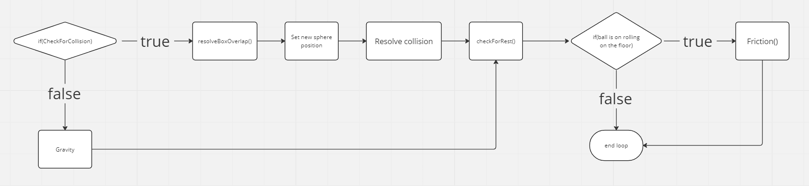

# Gravity and box collisions

## Gravity

My first objective was to implement free fall, which is the motion of any object falling under the influence of gravity without any other force acting on it. After some research on the nature of free fall, I came up with a simple implementation.

For every update, I incremented the position with the velocity value. The velocity value was also simultaneously being incremented by the acceleration due to gravity. This resulted in a free fall simulation.

## Box collisions

For sphere-box collisions, I referred to the code in SphereSphere. It used a ray tracing algorithm to calculate the final velocity vector from the initial velocity vector by reflecting it along the normal of the plane of collision.

Formula: 
    reflected velocity vector = initial velocity vector - 2 * (initial velocity vector . normal) * normal

 

## Improvements and modifications in Sphere-Box collisions

1. Energy increase bug: 
    One of the issues was that the sphere gained energy after each bounce, causing it to bounce higher. This occurred because gravity was still being applied when the sphere collided with the floor, leading to the extra energy causing the ball to rebound back higher. To solve this issue, I called gravity only when the sphere was not colliding with the floor.

2. Overlap with the Box:
    When sphere-box collision was detected, there was a slight overlap of the sphere with the box. To resolve this, I made a function to calculate the overlap distance and offset the sphere by that amount, so that it didn't overlap with the box.

3. Infinite energy bug:
    When the y component of the velocity reached extremely small values, it would oscillate between positive and negative values, causing it to bounce infinitely. It didn't settle at 0. To resolve this, I added a threshold value to the velocity vector. If the tip of the sphere was extremely close to the ground and the velocity vector was less than the threshold value, it would be set to 0, preventing infinite bouncing.

4. Implementing Friction:
    When the sphere was rolling on the ground (movement in x and z axes), I implemented friction so that it would eventually come to a stop.
    I calculated the friction and applied it to the velocity vector in each update. This resulted in the ball coming to a gradual stop due to friction on the ground.

    formula: friction = -1 * meu * N * normVelVec
    where, meu = kinetic coefficient of friction
           N = normal force
           normVelVec = normalized velocity vector

5. Loss of energy during collision:
    In real life, objects lose energy during collisions due to heat and sound. To simulate this loss of energy, I multiplied the final velocity vector after collision by a loss factor.  This resulted in the ball losing energy after every collision, gradually coming to rest, similar to real life.

## Next steps

In the next report, I will look at how to implement sphere-sphere collisions. This is covered in [report2.md](report2.md)
