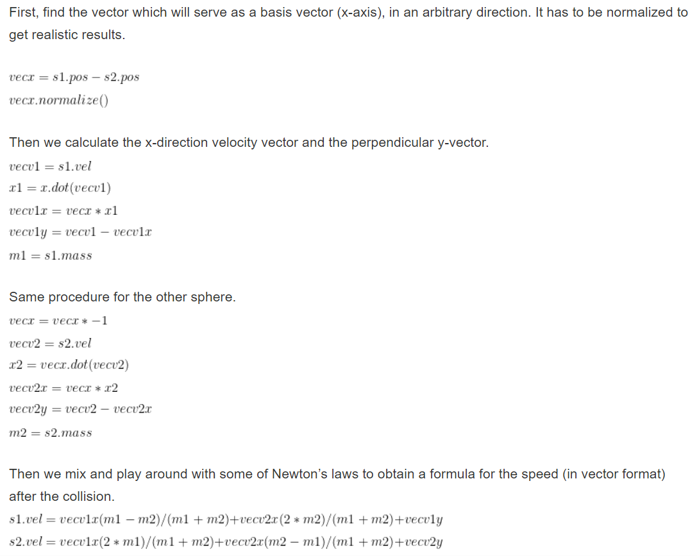
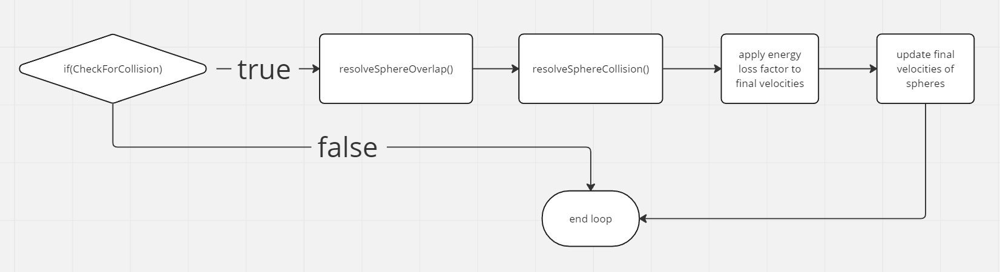

# Sphere to sphere collisions

## Overview

To store multiple Sphere objects, I made a std::vector array called m_spheres. This would allow me to loop through the array in a 2d nested for loop within itself, in order to check for collisions. There are multiple phases in sphere-sphere collisions, I will go through them in chronological order.

## Collision detection

To detect collisions between spheres, the distance between the centers of the spheres is calculated. If the distance is less than the sum of the radii of the spheres, then a collision is detected.

## Overlap resolution

To resolve the overlap between 2 spheres colliding, The overlap distance is calculated by subtracting the sum of the radii from the distance between the centers of the spheres. The spheres are then offset by half the overlap distance in opposite directions along the plane of collision.

## Collision resolution

The collision resolution algorithm calculates the final velocty vectors of both the spheres using the initial velocity vectors and the mass of the spheres.

Formula: 

 

reference: This particular algorithm was taken from https://studiofreya.com/3d-math-and-physics/simple-sphere-sphere-collision-detection-and-collision-response/

After the sphere-sphere collision is resolved, the energy loss factor is applied to the final velocity vectors and they are assigned to the respective spheres.

 

## Next steps

In the next report, I will be looking at the complete program structure and the ui design and user input handling. Refer to [report3.md](report3.md)

