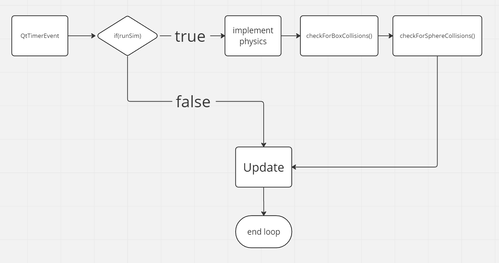

# Program structure and UI

## Program structure

After the implementation of all the algorithms required for the sphere collision system, The program flow maybe visualised like this:

 

All 3 phases of collision: detection, overlap correction and resolution are all implemented / called within the check functions shown in the diagram above. 

## UI Manual

A sphere has to be present in the scene before any of the parameters can be changed. The parameters allow dynamic control of the sphere's initial position and velocity, radius and mass. These will always affect the sphere that was last generated. (i.e. the lastest added to the scene)

The physics parameters are as follows:
    friction - the kinetic friction coefficient of the sphere (meu)
    energy loss - the percentage of energy lost in a collision (between 0 and 1)
    gravity - the acceleration due to gravity 

The randomise template simulation allows the user to pick a minimum and maximum mass and radius. The spheres generated will have randomised values within the range specified. The number of spheres generated can also be specified.

Lastly, the user can control the size of the bounding box, start, pause and reset the simulation.

## UI Logic

The "numSpheres" and "totalNumSpheres" variables track the number of spheres generated in an instance by the user and the total number of spheres in the scene respectively.

There are 2 arrays to manage the user input for the spheres. The "m_randomSpheres" array is used to generate the spheres when the user presses the "Generate" button.  it then inserts it's contents into "m_spheres" using m_sphere.pushBack() in a for loop, which is then used to render the spheres and also to implement the physics simulation.

## Future plans

1. The current implementation of the UI is not very fool proof, as I've mainly focussed on the logic of the simulation. In the future, I would like to polish the UI more and do error checking.
2. There are a few physics bugs still remaining, I would like to fix them in the future.
2. I also plan to add more complex object to object collisions.
3. As the logic of the collision system grows, the performance will likely get affected. Henceforth, I will look at techniques and methods to optimise collision detection and resolution.
